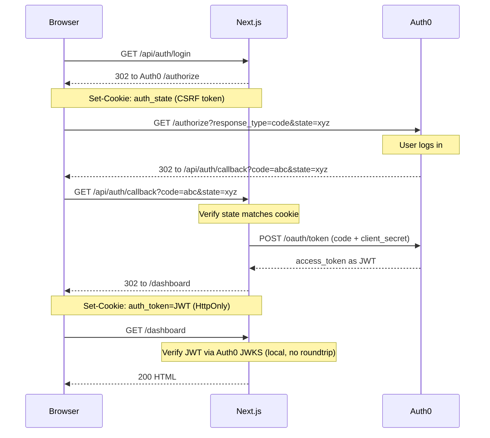

# Auth0 + Next.js

A reference implementation of Auth0 authentication in Next.js 15 using the **OAuth 2.0 Authorization Code flow** — built from scratch, no Auth0 SDK required.

Use it as a starting point or as a guide when rolling your own auth.

---

## How it works



The JWT is stored in an **HTTP-only cookie** so JavaScript can never read it. Every protected route verifies the token locally using Auth0's public JWKS endpoint — no session database needed.

---

## Project structure

```
├── middleware.ts              Edge-layer guard: redirects /dashboard and /profile if cookie absent
├── lib/
│   ├── auth.ts                verifyToken() — validates JWT against Auth0 JWKS using jose
│   └── session.ts             getSession() / requireSession() — for Server Components
└── app/
    ├── page.tsx               Landing page (redirects to /dashboard if already logged in)
    ├── dashboard/page.tsx     Protected Server Component — verifies JWT without a fetch
    ├── profile/page.tsx       Protected Client Component — fetches from /api/auth/me
    └── api/
        ├── auth/login/        Redirects to Auth0 /authorize with a CSRF state cookie
        ├── auth/callback/     Exchanges the code for a JWT, stores it in an HTTP-only cookie
        ├── auth/logout/       Clears the cookie and redirects to Auth0 /v2/logout
        ├── auth/me/           Returns the current user's profile (JWT-verified, server-side)
        └── protected/         Example protected API route (accepts cookie or Bearer header)
```

---

## Two auth patterns

### Server Component (recommended for pages)

```ts
// app/dashboard/page.tsx
import { requireSession } from '@/lib/session';

export default async function DashboardPage() {
  const { payload } = await requireSession(); // redirects to / if no valid session
  return <div>Hello {String(payload.sub)}</div>;
}
```

`requireSession()` reads the HTTP-only cookie and verifies the JWT in one step — no extra fetch, no client-side redirect.

### Client Component (when you need browser-side data)

```ts
// app/profile/page.tsx
'use client';
useEffect(() => {
  fetch('/api/auth/me').then(res => res.json()).then(setProfile);
}, []);
```

Client Components can't read HTTP-only cookies, so they call `/api/auth/me` which does the verification server-side and returns the profile.

### Protected API route

```ts
// app/api/protected/route.ts
import { verifyToken } from '@/lib/auth';

export async function GET(request: NextRequest) {
  const token = request.cookies.get('auth_token')?.value
    || request.headers.get('Authorization')?.replace('Bearer ', '');

  if (!token) return NextResponse.json({ error: 'Not authenticated' }, { status: 401 });

  const payload = await verifyToken(token); // throws if invalid
  return NextResponse.json({ data: '…', subject: payload.sub });
}
```

Accepts both cookie (browser) and `Authorization: Bearer` header (API clients / mobile).

---

## Setup

### 1. Create an Auth0 application

1. Go to [Auth0 Dashboard](https://manage.auth0.com/) → **Applications** → **Create Application**
2. Choose **Regular Web Application**
3. In **Settings**, set:
   - **Allowed Callback URLs:** `http://localhost:3000/api/auth/callback`
   - **Allowed Logout URLs:** `http://localhost:3000`
   - **Allowed Web Origins:** `http://localhost:3000`

### 2. Create an Auth0 API (optional but recommended)

Without an API audience, Auth0 issues an opaque access token that can't be verified locally. With one, it issues a JWT.

1. Go to **APIs** → **Create API**
2. Set an **Identifier** (e.g. `https://myapp.example.com`) — this becomes `AUTH0_AUDIENCE`
3. Keep the default signing algorithm (RS256)

### 3. Configure environment variables

```bash
cp .env.example .env.local
```

```env
AUTH0_DOMAIN=your-tenant.auth0.com
AUTH0_CLIENT_ID=your-client-id
AUTH0_CLIENT_SECRET=your-client-secret
AUTH0_AUDIENCE=https://myapp.example.com   # from step 2, or leave empty
AUTH0_SCOPE=openid profile email
APP_BASE_URL=http://localhost:3000
```

### 4. Run

```bash
npm install
npm run dev
```

Open [http://localhost:3000](http://localhost:3000) and click **Sign in with Auth0**.

---

## Security notes

| Concern | How it's handled |
|---|---|
| CSRF on the callback | `state` parameter — a random UUID stored in a short-lived HTTP-only cookie and verified on return |
| XSS token theft | Token stored in `httpOnly` cookie — JavaScript can never read it |
| Token expiry | `jwtVerify` (jose) rejects expired tokens; user is redirected to `/` |
| Auth0 session invalidation | Logout hits `/v2/logout` so Auth0's own session is cleared, preventing silent re-auth |
| Unverified middleware | Middleware only checks cookie presence (edge-fast); full JWT cryptographic verification happens in Server Components and API routes |

---

## Adapting for a separate backend (FastAPI, Express, etc.)

The pattern for a standalone API service is the same as `/api/protected/route.ts`:

1. Read the `Authorization: Bearer <token>` header
2. Fetch `https://<AUTH0_DOMAIN>/.well-known/jwks.json` and cache it
3. Verify the JWT signature, audience, and issuer
4. Reject with 401 if invalid; proceed if valid

---

## License

MIT
