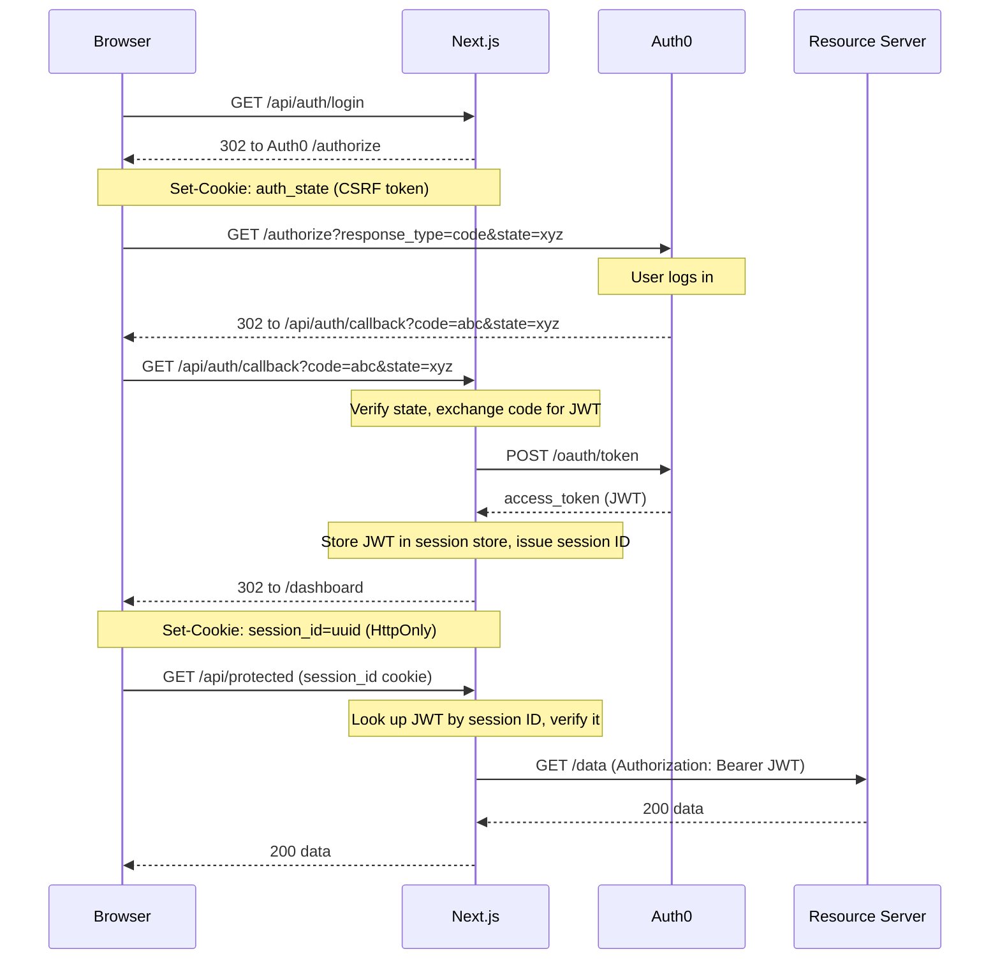

# Auth0 + Next.js

A reference implementation of Auth0 authentication in Next.js 15 using the **OAuth 2.0 Authorization Code flow** — built from scratch, no Auth0 SDK required.

Uses a **server-side session store** and a **BFF (Backend for Frontend)** pattern: the JWT never leaves the server, and all API calls from the browser go through Next.js API routes before being forwarded to any resource server.

---

## Architecture



**The JWT never reaches the browser.** The browser holds only an opaque session ID. Next.js API routes act as a BFF — they resolve the session to a JWT and forward requests to resource servers on behalf of the browser.

---

## Session design

| | Traditional JWT cookie | This implementation |
|---|---|---|
| Cookie content | The JWT itself | Opaque session ID (UUID) |
| JWT location | Browser cookie | Server-side memory store |
| Visible in DevTools | Yes (cookie value) | No |
| Revocable server-side | No | Yes — delete from store |
| Scales across replicas | Yes (stateless) | Needs shared store (Redis) |

The in-memory store in `lib/session-store.ts` is intentionally simple to swap out. Replace `createSession`, `getSessionData`, and `deleteSessionData` with Redis / DB calls and nothing else changes.

---

## Project structure

```
├── middleware.ts              Edge-layer guard: redirects /dashboard and /profile if no session cookie
├── lib/
│   ├── auth.ts                verifyToken() — validates JWT against Auth0 JWKS using jose
│   ├── session-store.ts       In-memory session store (swap for Redis/DB in production)
│   └── session.ts             getSession() / requireSession() — for Server Components
└── app/
    ├── page.tsx               Landing page (redirects to /dashboard if already logged in)
    ├── dashboard/page.tsx     Protected Server Component — session resolved server-side
    ├── profile/page.tsx       Protected Client Component — fetches from /api/auth/me
    └── api/
        ├── auth/login/        Redirects to Auth0 /authorize with a CSRF state cookie
        ├── auth/callback/     Exchanges code for JWT, creates session, sets session_id cookie
        ├── auth/logout/       Deletes session from store, clears cookie, redirects to Auth0 /v2/logout
        ├── auth/me/           Resolves session → JWT → Auth0 /userinfo, returns profile
        └── protected/         Example BFF route: resolves session → JWT → forwards to resource server
```

---

## Patterns

### Server Component

```ts
// app/dashboard/page.tsx
import { requireSession } from '@/lib/session';

export default async function DashboardPage() {
  const { payload } = await requireSession(); // redirects to / if no valid session
  return <div>Hello {String(payload.sub)}</div>;
}
```

`requireSession()` reads the session ID cookie, looks up the JWT in the store, and verifies it — all on the server, in one step.

### Client Component

```ts
// app/profile/page.tsx
'use client';
useEffect(() => {
  fetch('/api/auth/me').then(res => res.json()).then(setProfile);
}, []);
```

Client Components can't access the session store directly, so they call a Next.js API route which resolves the session and returns only the data the browser needs.

### BFF API route (proxying to a resource server)

```ts
// app/api/your-resource/route.ts
import { getSessionData } from '@/lib/session-store';
import { verifyToken } from '@/lib/auth';

export async function GET(request: NextRequest) {
  const sessionId = request.cookies.get('session_id')?.value;
  if (!sessionId) return NextResponse.json({ error: 'Not authenticated' }, { status: 401 });

  const data = getSessionData(sessionId);
  if (!data) return NextResponse.json({ error: 'Session not found' }, { status: 401 });

  await verifyToken(data.token); // throws if expired or invalid

  // Forward to your resource server with the JWT — browser never sees this URL or token
  const res = await fetch(`${process.env.RESOURCE_SERVER_URL}/endpoint`, {
    headers: { Authorization: `Bearer ${data.token}` },
  });

  return NextResponse.json(await res.json());
}
```

The browser calls `/api/your-resource`. Next.js resolves the session to a JWT and forwards to the real backend. The resource server URL and JWT stay server-side.

---

## Setup

### 1. Create an Auth0 application

1. Go to [Auth0 Dashboard](https://manage.auth0.com/) → **Applications** → **Create Application**
2. Choose **Regular Web Application**
3. In **Settings**, set:
   - **Allowed Callback URLs:** `http://localhost:3000/api/auth/callback`
   - **Allowed Logout URLs:** `http://localhost:3000`
   - **Allowed Web Origins:** `http://localhost:3000`

### 2. Create an Auth0 API (optional but recommended)

Without an API audience, Auth0 issues an opaque access token that cannot be verified locally. With one, it issues a JWT.

1. Go to **APIs** → **Create API**
2. Set an **Identifier** (e.g. `https://myapp.example.com`) — this becomes `AUTH0_AUDIENCE`
3. Keep the default signing algorithm (RS256)

### 3. Configure environment variables

```bash
cp .env.example .env.local
```

```env
AUTH0_DOMAIN=your-tenant.auth0.com
AUTH0_CLIENT_ID=your-client-id
AUTH0_CLIENT_SECRET=your-client-secret
AUTH0_AUDIENCE=https://myapp.example.com   # from step 2, or leave empty
AUTH0_SCOPE=openid profile email
APP_BASE_URL=http://localhost:3000
```

### 4. Run

```bash
npm install
npm run dev
```

Open [http://localhost:3000](http://localhost:3000) and click **Sign in with Auth0**.

---

## Security notes

| Concern | How it's handled |
|---|---|
| CSRF on the callback | `state` parameter — random UUID in a short-lived HTTP-only cookie, verified on return |
| JWT exposure to browser | JWT is never sent to the client — only an opaque session ID cookie |
| XSS token theft | Session ID cookie is `httpOnly` — inaccessible to JavaScript |
| Token expiry | `jwtVerify` (jose) rejects expired tokens; session resolves to null, user redirected to `/` |
| Session revocation | Delete the session ID from the store to immediately invalidate access |
| Auth0 session invalidation | Logout hits `/v2/logout` so Auth0's own session is cleared, preventing silent re-auth |
| Unverified middleware | Middleware checks session cookie presence only (edge-fast); full verification happens in API routes and Server Components |

---

## Production considerations

- **Replicas:** the in-memory store does not survive process restarts and is not shared across pods. Replace `lib/session-store.ts` with a Redis adapter before running more than one replica.
- **Session expiry:** the current store has no TTL. Add expiry logic in `getSessionData` or rely on the JWT's own `exp` claim (already enforced by `verifyToken`).
- **HTTPS:** set `secure: true` on the session cookie in production (already done when `NODE_ENV=production`).

---

## License

MIT
