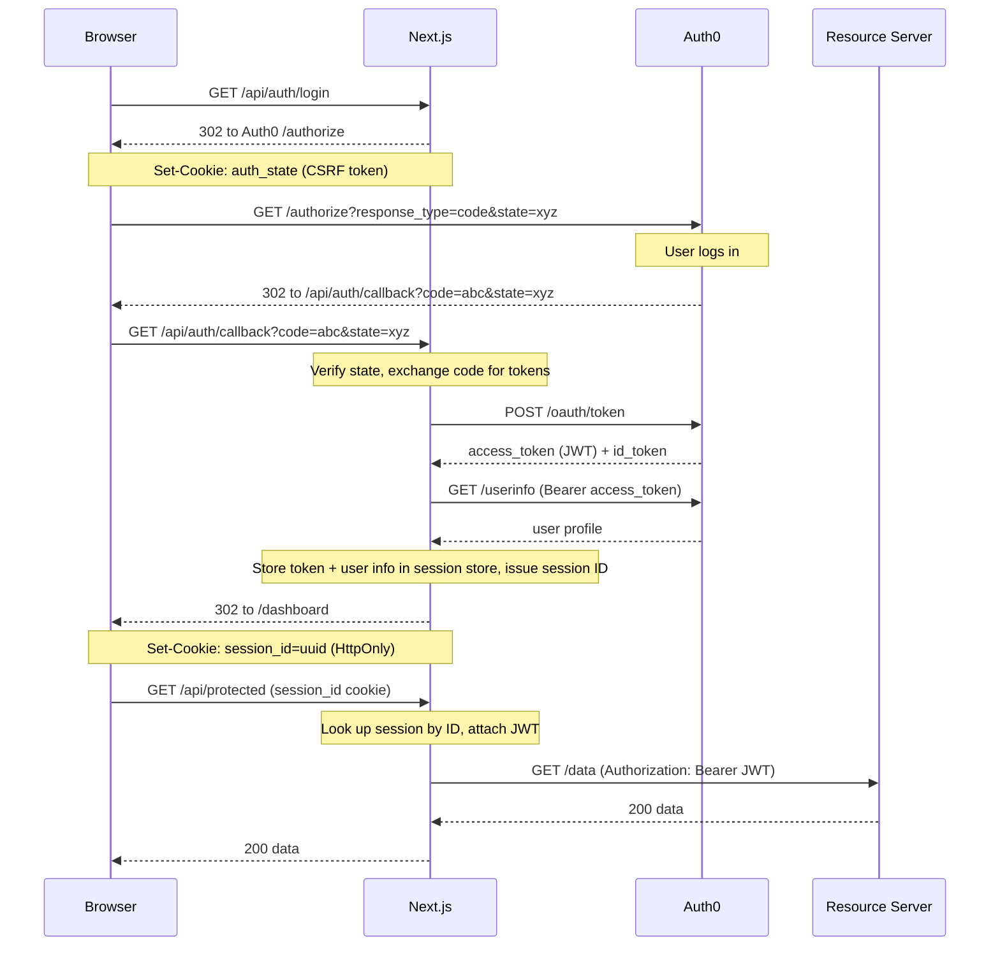

# Auth0 + Next.js

**Production-ready Auth0 authentication for Next.js 15 — no SDK, no magic, just the real OAuth 2.0 flow written out so you can read and own it.**

[](LICENSE)
[](https://nextjs.org)
[](https://www.typescriptlang.org)
[](https://auth0.com)

---

## Why this exists

If you are building an app — your own idea, a side project, something for your team — and you are thinking about adding login, **please don't build auth yourself.**

Not because it's too hard. Because it's too easy to get wrong in ways that are invisible until someone gets hurt. Password hashing, token storage, session fixation, brute force protection, secure cookie flags, CSRF — each one is a chapter in a security textbook, and getting any of them slightly wrong quietly exposes your users.

This repo exists so you don't have to think about any of that.

---

## Use Auth0. Here's why.

[Auth0](https://auth0.com) is **free** for most personal and small projects (up to 25,000 monthly active users on the free tier). It handles:

- Passwords, hashing, and breach detection
- Social login (Google, GitHub, etc.) in a few clicks
- Multi-factor authentication
- Suspicious login detection
- Token signing and rotation
- Compliance (SOC2, GDPR, HIPAA)

Years of security engineering, maintained by a dedicated team, free. There is no version of rolling your own auth that beats this — not for a side project, not for a startup, not for an internal tool.

The only thing Auth0 doesn't do is wire itself into your app. That's what this repo is for.

---

## Quick start

```bash
git clone https://github.com/taha2009/auth0-nextjs.git
cd auth0-nextjs
cp .env.example .env.local   # fill in your Auth0 credentials
npm install
npm run dev
```

Open [http://localhost:3000](http://localhost:3000). Done.

> **New to Auth0?** See [Setup](#setup) below for a 5-minute walkthrough of creating a free Auth0 account and getting your credentials.

[](https://vercel.com/new/clone?repository-url=https%3A%2F%2Fgithub.com%2Ftaha2009%2Fauth0-nextjs&env=AUTH0_DOMAIN,AUTH0_CLIENT_ID,AUTH0_CLIENT_SECRET,AUTH0_AUDIENCE,AUTH0_SCOPE,APP_BASE_URL&envDescription=Auth0%20credentials%20and%20your%20app%20URL&project-name=auth0-nextjs&repository-name=auth0-nextjs)

---

## Architecture

This repo uses a **server-side session store** and a **BFF (Backend for Frontend)** pattern. The JWT Auth0 issues after login never reaches the browser — the browser only holds an opaque session ID, useless without the server.



All API calls from the browser go through Next.js API routes, which attach the JWT before forwarding to any backend service. The browser never sees the token, the resource server URL, or anything about Auth0.

---

## Session design

| | JWT in cookie *(common but weaker)* | This implementation |
|---|---|---|
| Cookie content | The JWT itself | Opaque session ID (UUID) |
| JWT visible in DevTools | Yes | No |
| Revocable before expiry | No | Yes — delete from store |
| Scales across replicas | Yes (stateless) | Needs shared store (Redis) |

The session store holds both the JWT access token (for forwarding to resource servers) and the user profile fetched from `/userinfo` at login time. Subsequent requests are just a store lookup — no per-request JWT verification or network calls.

The in-memory store in `lib/session-store.ts` is intentionally simple to swap out. Replace `createSession`, `getSessionData`, and `deleteSessionData` with Redis calls and nothing else in the codebase changes.

---

## Project structure

```
├── middleware.ts              Edge-layer guard: redirects /dashboard and /profile if no session cookie
├── lib/
│   ├── auth.ts                verifyToken() — validates JWT against Auth0 JWKS using jose
│   ├── session-store.ts       In-memory session store (swap for Redis/DB in production)
│   └── session.ts             getSession() / requireSession() — for Server Components
└── app/
    ├── page.tsx               Landing page (redirects to /dashboard if already logged in)
    ├── dashboard/page.tsx     Protected Server Component — session resolved server-side
    ├── profile/page.tsx       Protected Client Component — fetches from /api/auth/me
    └── api/
        ├── auth/login/        Redirects to Auth0 /authorize with a CSRF state cookie
        ├── auth/callback/     Exchanges code → JWT + /userinfo, stores both in session, sets session_id cookie
        ├── auth/logout/       Deletes session from store, clears cookie, redirects to Auth0 /v2/logout
        ├── auth/me/           Returns cached user profile from session store
        └── protected/         Example BFF route: looks up JWT by session ID, verifies it, forwards to resource server
```

---

## Patterns

### Server Component (recommended for pages)

```ts
// app/dashboard/page.tsx
import { requireSession } from '@/lib/session';

export default async function DashboardPage() {
  const { user } = await requireSession(); // redirects to / if no valid session
  return <div>Hello {user.name}</div>;
}
```

`requireSession()` reads the session ID cookie and looks up the session in the store — the user profile is available immediately with no additional network calls.

### Client Component

```ts
// app/profile/page.tsx
'use client';
useEffect(() => {
  fetch('/api/auth/me').then(res => res.json()).then(setProfile);
}, []);
```

Client Components can't access the session store directly, so they call a Next.js API route which resolves the session and returns only the data the browser needs.

### BFF API route (proxying to a resource server)

The browser sends a session cookie. The Next.js API route looks up the JWT and forwards it as a Bearer token. The resource server verifies the JWT on its end.

```ts
// app/api/your-resource/route.ts
import { getSessionData } from '@/lib/session-store';

export async function GET(request: NextRequest) {
  const sessionId = request.cookies.get('session_id')?.value;
  if (!sessionId) return NextResponse.json({ error: 'Not authenticated' }, { status: 401 });

  const data = getSessionData(sessionId);
  if (!data) return NextResponse.json({ error: 'Session not found' }, { status: 401 });

  // Forward to your resource server — browser never sees this URL or the JWT
  const res = await fetch(`${process.env.RESOURCE_SERVER_URL}/endpoint`, {
    headers: { Authorization: `Bearer ${data.token}` },
  });

  return NextResponse.json(await res.json());
}
```

---

## Setup

### Option A — CLI (recommended)

First, sign up at [auth0.com](https://auth0.com) — a default tenant is created for you automatically. Then install the [Auth0 CLI](https://auth0.com/docs/cli) and run these commands once. Everything is provisioned in under a minute.

```bash
# 1. Authenticate the CLI against your tenant
auth0 login

# 2. Create a Regular Web Application and capture its credentials
auth0 apps create \
  --name "My App" \
  --type regular \
  --callbacks "http://localhost:3000/api/auth/callback" \
  --logout-urls "http://localhost:3000" \
  --web-origins "http://localhost:3000" \
  --reveal-secrets \
  --json
# → note down client_id, client_secret, and the domain from the output

# 3. Create an API resource server (gives you a verifiable JWT access token)
auth0 apis create \
  --name "local" \
  --identifier "http://localhost:3000" \
  --json
# → note down the id field

# 4. Skip the Auth0 consent screen for first-party apps
#    skip_consent handles database users; allow_all user policy handles social logins
auth0 api patch "resource-servers/<API_ID>" \
  --data '{"skip_consent_for_verifiable_first_party_clients":true,"subject_type_authorization":{"user":{"policy":"allow_all"},"client":{"policy":"require_client_grant"}}}'
```

> **Note:** If you use social login (Google etc.) via Auth0's built-in dev credentials, Google will still show its own consent screen on first login. To suppress it, create a Google OAuth app in Google Cloud Console and add the credentials to your Auth0 tenant under **Authentication → Social → Google**.


Then fill in your `.env.local`:

```bash
cp .env.example .env.local
```

```env
AUTH0_DOMAIN=<your-tenant>.auth0.com
AUTH0_CLIENT_ID=<client_id from step 2>
AUTH0_CLIENT_SECRET=<client_secret from step 2>
AUTH0_AUDIENCE=http://localhost:3000
AUTH0_SCOPE=openid profile email
APP_BASE_URL=http://localhost:3000
```

---

### Option B — Dashboard

#### 1. Create a free Auth0 account

Sign up at [auth0.com](https://auth0.com) — no credit card required.

#### 2. Create an Auth0 application

1. Dashboard → **Applications** → **Create Application**
2. Choose **Regular Web Application**
3. In **Settings**, set:
   - **Allowed Callback URLs:** `http://localhost:3000/api/auth/callback`
   - **Allowed Logout URLs:** `http://localhost:3000`
   - **Allowed Web Origins:** `http://localhost:3000`
4. Copy **Domain**, **Client ID**, and **Client Secret** into your `.env.local`

#### 3. Create an Auth0 API

Without an audience, Auth0 issues an opaque access token that cannot be forwarded to or verified by resource servers. With one, it issues a signed JWT.

1. Dashboard → **APIs** → **Create API**
2. Set an **Identifier** — any URL-style string, e.g. `https://myapp.example.com`
3. This identifier becomes your `AUTH0_AUDIENCE` env var
4. Dashboard → **APIs** → select the API you just created → **Application Access** → enable your application
5. On the same page → **Settings** → enable **Allow Skipping User Consent** to suppress the consent screen for first-party apps

#### 4. Configure environment variables

```bash
cp .env.example .env.local
```

```env
AUTH0_DOMAIN=your-tenant.auth0.com
AUTH0_CLIENT_ID=your-client-id
AUTH0_CLIENT_SECRET=your-client-secret
AUTH0_AUDIENCE=https://myapp.example.com   # from step 3
AUTH0_SCOPE=openid profile email
APP_BASE_URL=http://localhost:3000
```

---

## Deployment

### Vercel *(easiest)*

Click the deploy button at the top, or:

```bash
npm i -g vercel
vercel
```

Set the environment variables in the Vercel dashboard under **Settings → Environment Variables**. Update your Auth0 app's Allowed URLs to your production domain.

### Docker

```dockerfile
FROM node:20-alpine AS builder
WORKDIR /app
COPY . .
RUN npm ci && npm run build

FROM node:20-alpine
WORKDIR /app
COPY --from=builder /app/.next/standalone ./
COPY --from=builder /app/.next/static ./.next/static
COPY --from=builder /app/public ./public
EXPOSE 3000
CMD ["node", "server.js"]
```

Pass env vars at runtime via `-e` flags or a Kubernetes secret. The app reads all Auth0 config from the environment at request time — no rebuild needed to switch tenants or credentials.

### Kubernetes / multiple replicas

The in-memory session store works for a single pod. For multiple replicas, replace `lib/session-store.ts` with a Redis adapter — the interface is three functions (`createSession`, `getSessionData`, `deleteSessionData`) so the swap is contained to one file.

---

## Security notes

| Concern | How it's handled |
|---|---|
| CSRF on the callback | `state` parameter — random UUID in a short-lived HTTP-only cookie, verified on return |
| JWT never reaches browser | JWT lives in the server-side session store — only an opaque session ID is sent to the client |
| XSS token theft | Session ID cookie is `httpOnly` — inaccessible to JavaScript |
| Token expiry | `jwtVerify` (jose) rejects expired tokens; session resolves to null, user redirected to `/` |
| Session revocation | Delete the session ID from the store to immediately invalidate access |
| Auth0 session invalidation | Logout hits `/v2/logout` so Auth0's own session is cleared, preventing silent re-auth |
| Unverified middleware | Middleware checks session cookie presence only (edge-fast); full cryptographic verification happens in API routes and Server Components |

---

## License

MIT
